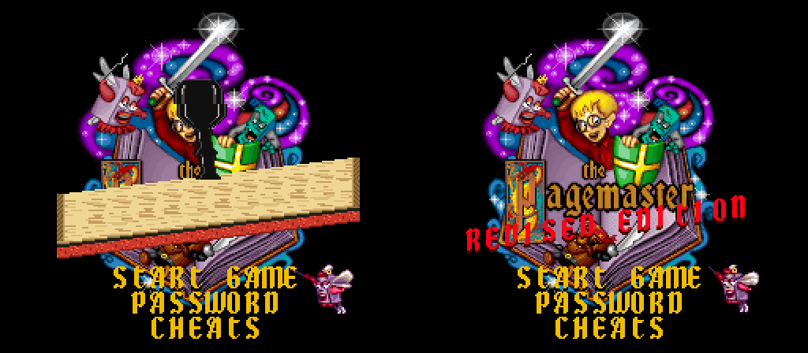

# The Pagemaster (SNES) - Revised Edition

An IPS patch for the US version of *The Pagemaster* (SNES, 1994) that fixes its roughest edges and adds a few extras.

## Patching

1. You need your own copy of the US ROM (2 MB, no copier header). SHA-1: `02fa190bfbed8699ce8f741bac6675f3582ced68`
2. Apply [`patch/pagemaster-revised-edition.ips`](patch/pagemaster-revised-edition.ips) with any IPS patcher (Floating IPS, Lunar IPS, [RomPatcher.js](https://www.marcrobledo.com/RomPatcher.js/)).
3. The patched ROM's SHA-1 should be `874d399be73433533fb53f95da1b10c9089dd36b`.

Tested in Mesen. This repository contains no game data, only the changes.

## What's changed

**Fairer gameplay**
- Less picky hit detection: grazing an enemy or hazard no longer counts as a hit
- Three hits per life, shown as three gold blocks in the top left. They refill every level, and falling in a pit costs one block instead of a whole life
- Pickups no longer need a dead-center hit
- The thin open-book platforms catch you when you only just reach them
- Flying books are fixed: slow, floaty jumps no longer fall through them, and the area that catches you matches how wide the book looks

**Movement feel**
- Running speeds up and slows down faster, so you slide less after letting go
- Jumps start one frame sooner

**Title screen**
- A red, slanted "REVISED EDITION" banner, stamped onto the page by an animated wood-grain rubber stamp with a thud sound (the title screen had no sound effects, so the thud is a new sound added to the title's sound bank)
- The title music starts right after the thud

**CHEATS menu** (third item on the title screen)
- Invincible, infinite lives, 5 hit blocks, full library cards, moon jump, super speed
- Level select: any of the 65 levels by world and number, then PLAY ([level list](LEVEL_SELECT.md))
- Cheats switch off every time the game is turned on

Controls on the CHEATS screen: Up/Down moves, Left/Right/A toggles or changes a value, B goes back. The selected row is red.

## Building from source

The patches in [`src/patches`](src/patches) are [asar](https://github.com/RPGHacker/asar) sources applied in the order in [`src/build.sh`](src/build.sh) to the original ROM. [`src/TECHNICAL_NOTES.md`](src/TECHNICAL_NOTES.md) records how the game's collision, title screen and sound driver work, for anyone who wants to build on this. The stamp art, digits, level names and thud are generated by the Python scripts in `src`.

## Credits

Hack by Dave (svchostexe), built with Claude (Anthropic). *The Pagemaster* is a trademark of its rights holders; this is an unofficial fan patch.

## License

MIT for the patch, source and new art/sound (see [LICENSE](LICENSE)). No game data is included.
